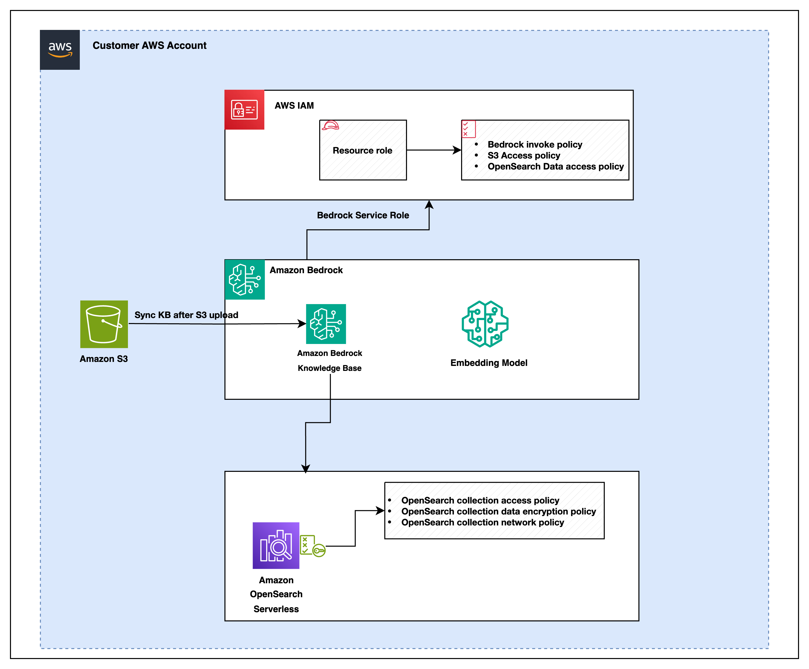

# Deploy Amazon Bedrock Knowledge Bases for RAG-based GenAI applications using Terraform

## Overview
Retrieval Augmented Generation (RAG) enhances generative AI applications by providing foundation models (FMs) access to additional, relevant data. This approach improves response accuracy and transparency without requiring constant FM retraining.

Many customers are using Amazon Bedrock Knowledge Bases to help implement RAG workflows. While the AWS console makes it easy to deploy an Amazon Bedrock Knowledge Base initial development in just a few clicks, setting up your infrastructure-as-code (IaC) template for deployment requires specifying additional resource details that are abstracted away in the console. Although CDK-based templates are available for setting up Bedrock Knowledge Bases, many organizations use Terraform as their preferred infrastructure-as-code framework.

### Architecture Overview
The architecture illustrates a seamless data flow from Amazon S3 through Amazon OpenSearch Serverless to Amazon Bedrock Knowledge Bases, leveraging AWS Identity and Access Management (IAM) roles for secure and efficient operations.

 


This repository contains a Terraform template to deploy resources required for a Retrieval-Augmented Generation (RAG) solution using various AWS services such as Bedrock, Bedrock Knowledgebase (Kendra or OpenSearch), and S3. The solution integrates AWS-managed services to build a scalable infrastructure for RAG-based applications.

The solution utilizes the following AWS services:
* Bedrock
    * For query classification, text generation, and refining the set of relevant data or responses retrieved from a knowledge base.
* Bedrock Knowledge Bases
    * For retrieving relevant information or data.
    * Can be integrated with search backends like OpenSearch and synced with S3 data sources.
* AWS OpenSearch
    * Provides a fast and secure search engine to index and search large datasets or documents.
* S3
    * For storing structured and unstructured data, such as schemas, files, and staging information ingested to the Knowledge Base.

## Infrastructure template

Please note that this Terraform code is for sample use only and may require customization based on your specific environment and requirements.

As a user, it is your responsibility to ensure that all necessary variables (e.g., S3 bucket names, region, etc.) are correctly updated before using this code. Failure to do so might lead to issues or misconfigurations in your environment.

This repository provides sample code and is intended for demonstration purposes only. You are responsible for testing, customizing, and securing the configuration before deploying it in a production environment.

### Prerequisites

Terraform installed on your local machine.

AWS CLI configured with appropriate credentials.

An AWS account with sufficient permissions to deploy resources.

# Deployment Instructions

Decide where to clone the repository based on your environment:

Local Machine: If working directly on your laptop or desktop.
EC2 Instance: For remote server deployments.
AWS CloudShell: If using AWS's browser-based CLI.

Open a terminal window. Assuming you are in the root directory, run the following command to clone the repository: 
 ```{bash}
git clone https://github.com/aws-samples/sample-bedrock- knowledge-base-terraform

```

Navigate to the Project Directory Move into the cloned directory:

 ```{bash}
cd sample-bedrock-knowledge-base-terraform

```

## Manual Configuration Instructions

### Provide S3 Bucket 
Update the kb_s3_bucket_name_prefix variable in the module to point to the S3 bucket name you want to use. This is critical for the module to function properly.

```{bash}
module "my_module" {
  source = "./modules"
  # Pass any required variables for the module
  kb_s3_bucket_name_prefix = "your-s3-bucket-name" # Passing the bucketname variable to the module
}

```

### Update the region

Define the AWS region directly in the Terraform configuration file by modifying the provider block in main.tf file. This will override any profile or environment variables for the region.

```{bash}
provider "aws" {
  region = "us-east-1"
}

```
### Optional Configurations


#### Chunking Strategy

The default strategy is DEFAULT. To customize, update the chunking_strategy variable with one of the following:

* DEFAULT: Standard chunking of about 300 tokens with no additional customization.
* FIXED_SIZE: Divides content into fixed-size chunks with optional overlaps.
* HIERARCHICAL: Creates hierarchical chunks with parent-child structures.
* SEMANTIC: Splits content based on semantic meaning for improved contextual grouping.
* NONE: Suitable for documents that are already pre-processed or text split into seperate files without any further     chunking necessary.

File: main.tf

Line: Look for the chunking_strategy variable in module "my_module".

```{bash}
module "my_module" {
  chunking_strategy = "FIXED_SIZE"  # Replace with your desired chunking strategy
}

```

##### Related Chunking Variables

If you select a specific chunking strategy (e.g., FIXED_SIZE, HIERARCHICAL, SEMANTIC), you can further customize the behavior by updating the related variables in the variables.tf file.

For FIXED_SIZE:
  * fixed_size_max_tokens: Maximum number of tokens per chunk.
  * fixed_size_overlap_percentage: Percentage overlap between chunks.

```{bash}
variable "fixed_size_max_tokens" {
  default = 512  # Maximum tokens per chunk
}

variable "fixed_size_overlap_percentage" {
  default = 20  # Overlap percentage between chunks
}

```

For HIERARCHICAL:
  *  hierarchical_parent_max_tokens: Maximum tokens for parent chunks.
  *  hierarchical_child_max_tokens: Maximum tokens for child chunks.
  * hierarchical_overlap_tokens: Number of tokens to overlap between chunks.

```{bash}
variable "hierarchical_parent_max_tokens" {
  default = 1000  # Max tokens for parent chunks
}

variable "hierarchical_child_max_tokens" {
  default = 500  # Max tokens for child chunks
}

variable "hierarchical_overlap_tokens" {
  default = 70  # Tokens to overlap between parent and child chunks
}

```
For SEMANTIC:
  *   semantic_max_tokens: Maximum number of tokens per chunk.
  *   semantic_buffer_size: Buffer size for semantic chunking.
  *   semantic_breakpoint_percentile_threshold: Breakpoint percentile threshold.

```{bash}
variable "semantic_max_tokens" {
  default = 512  # Maximum tokens for semantic chunks
}

variable "semantic_buffer_size" {
  default = 1  # Buffer size for semantic chunking
}

variable "semantic_breakpoint_percentile_threshold" {
  default = 75  # Percentile threshold for breaking chunks
}


```

#### Embedding Model

If not provided, the default "amazon.titan-embed-text-v2:0" will be used. To specify another model, update the kb_model_id variable.

File: main.tf

Line: Look for the kb_model_id variable in module "my_module".

```{bash}
module "my_module" {
  kb_model_id = null  # Leave as null for default or specify another model ID
}

```

#### Knowledge Base Name

If not provided, the default value "resourceKB" will be used. To customize, update the kb_name variable.

File: main.tf

Line: Look for the kb_name variable in module "my_module".

```{bash}
module "my_module" {
  kb_name = null  # Leave as null for default or replace with your desired knowledge base name
}

```

#### OpenSearch Serverless Name

If not provided, the default value "bedrock-resource-kb" will be used. To customize, update the kb_oss_collection_name variable.

File: main.tf

Line: Look for the kb_name variable in module "my_module".

```{bash}
module "my_module" {
  kkb_oss_collection_name   = null   # Leave as null to use the default OpenSearch value "bedrock-resource-kb", or replace with a custom name 
}

```

### Deploy the stack

Open a terminal window and assuming you are in root directory.

```{bash}
terraform init
terraform plan
terraform apply

```

### Destroy the stack

Open your terminal and navigate to the directory containing your Terraform configuration files.

```{bash}
terraform destroy

```
This command will delete all infrastructure resources defined in your Terraform configuration.

Clear Terraform State Files (Optional):

If you want to remove the Terraform state files and completely clean up the project directory, delete the following files and directories:

```{bash}
rm -rf .terraform/
rm .terraform.lock.hcl
rm terraform.tfstate
rm terraform.tfstate.backup

```
## Security

See [CONTRIBUTING](CONTRIBUTING.md#security-issue-notifications) for more information.

## License

This library is licensed under the MIT-0 License. See the LICENSE file.

